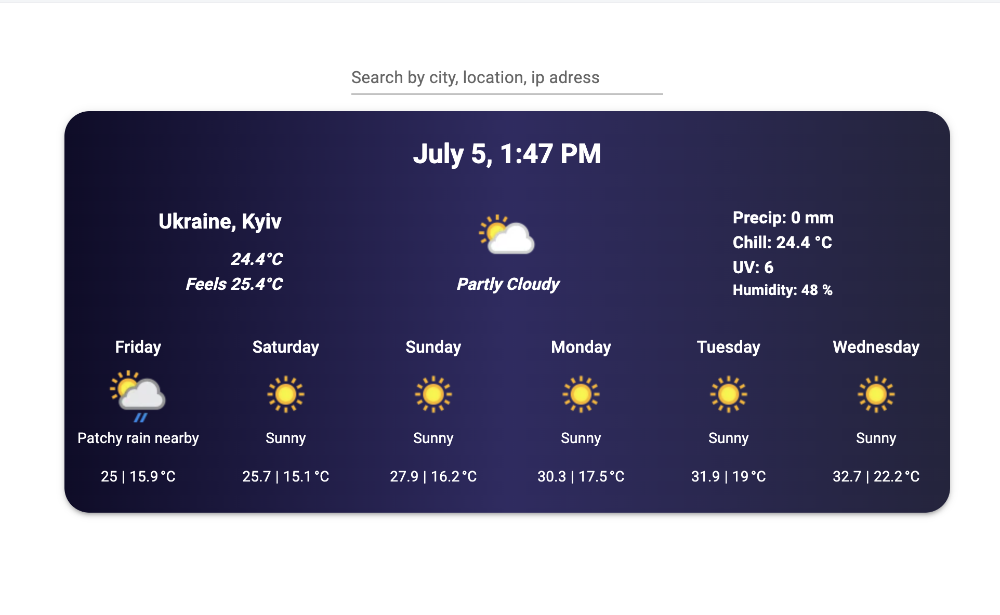

# Weather Widget

A simple responsive weather widget that shows the current weather of the user's location or searched location.

## Preview


## Features
- Adaptive widget layout for mobile and desktop.
- Shows the current weather of the user's location.
- Search for a location by city name or latitude and longitude or ip address.
- Lazy loading of the weather widget.
- Handles loading and error states.

## Installation

```bash
git clone git@github.com:Ex-Zy/weather-widget.git

cd weather-widget

npm install
```

## Usage

```bash
npm run dev
```

## Build

```bash
npm run build
```

## Tools used:
- Vite
- Typescript
- Material UI
- OpenWeatherMap API
- IP API
- React
- React custom hooks
